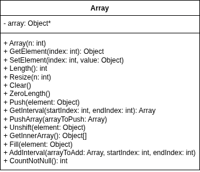

# Dokumentáció

## 1. Fedlap
**Tárgy:** Objektumelvű/Objektumorientált programozás
**Feladat:** 1. beadandó feladat - Array
**Készítette:** Ballai Péter Lóránt
**Neptun kód:** Eyseed
**Dátum:** 2026. 03. 17.

---

## 2. Feladatleírás
Írjon egy `Array` nevű osztályt, amellyel egy tetszőleges méretű belső tömbben adatokat tudunk tárolni!
* Az osztály belsőleg egy tömböt használjon az adatok tárolására.
* A tömb mérete legyen `n`.
* A belső tömb tároljon `Object` típusokat.
Egy osztály szolgáltatásainak (összes metódusának) bemutatásához olyan főprogramot kell készíteni, amelyik egy menü segítségével teszi lehetővé a metódusok tetszőleges sorrendben történő kipróbálását. A főprogram példányosítson egy objektumot, amelyre a menüpontok közvetítésével lehessen meghívni az egyes metódusokat. Az osztály minden megírt metódusához írjon unit tesztet is (MSTest). A problémákat (pl. hibás beadott értékek) kezelje le konzisztensen kivételek (Exception) dobásával.

---

## 3. Típusleírás
A feladat lényege egy egyedi, dinamikusan méretezhető tömb (`Array`) típus megvalósítása, bemutatása és tesztelése C# nyelven.

### Típusérték-halmaz
Az osztály képes eltárolni tetszőleges számú `Object` típusú elemet. A belső tömb hossza dinamikusan változtatható, és üres (null) értékeket is képes kezelni.

---

## 4. Megvalósított funkciók (Konzolos menü alapján)
1. **Létrehozás (Constructor):** Példányosítja a tömböt a megadott `n` mérettel.
2. **Elem lekérdezése (GetElement):** Visszaadja a megadott indexen lévő elemet.
3. **Elem beállítása (SetElement):** A megadott indexen lévő értéket felülírja.
4. **Méret lekérdezése (Length):** Visszaadja a tömb aktuális méretét.
5. **Átméretezés (Resize):** Megváltoztatja a tömb méretét, megtartva a régi elemeket (amíg be nem telik az új méret).
6. **Kiürítés (Clear):** A tömb összes elemét `null` értékre állítja, a méret megtartása mellett.
7. **Nullázás (ZeroLength):** A tömb méretét 0-ra csökkenti (minden adat elvész).
8. **Hozzáadás a végére (Push):** A tömb méretét megnöveli eggyel, és az új elemet a végére fűzi.
9. **Intervallum lekérdezése (GetInterval):** Visszaad egy új `Array` objektumot, amely az eredeti tömb egy szeletét tartalmazza.
10. **Tömb hozzáadása (PushArray):** Egy másik `Array` elemeit hozzáfűzi a jelenlegi tömb végéhez.
11. **Hozzáadás az elejére (Unshift):** A tömb méretét megnöveli eggyel, minden elemet jobbra tol, és az új elemet a 0. indexre teszi.
12. **Belső tömb lekérdezése (GetInnerArray):** Visszaadja a nyers `Object[]` referenciát.
13. **Feltöltés (Fill):** A tömb összes elemét felülírja a megadott értékkel.
14. **Intervallum hozzáadása (AddInterval):** Egy másik `Array` megadott szeletét hozzáfűzi a jelenlegi tömb végéhez.
15. **Nem null elemek száma (CountNotNull):** Megszámolja és visszaadja, hány index tartalmaz értéket.

---

## 5. UML Osztálydiagram



---

## 6. Reprezentáció
Az adatokat belsőleg egy privát `Object[] array;` típusú, egydimenziós tömbben tároljuk. A méretet és a kapacitást maga a C# belső tömbjének `Length` tulajdonsága határozza meg, így nincs szükség külön `n` változó tárolására és adminisztrálására. Ha a tömb méretét növelni vagy csökkenteni kell, egy új tömböt hozunk létre a memóriában, és a referenciát (`this.array`) átállítjuk erre az újra.

---

## 7. Implementált függvények rövid ismertetése (Pszeudokód)

A dokumentációban a legfontosabb (nem triviális) algoritmusokat pszeudokód segítségével ábrázoljuk.

**Átméretezés (Resize)**
Egy új tömböt hoz létre, és átmásolja a régi elemeket.
```text
copy := new Object[n]
min := |array|
if n < |array| then min := n endif
i := 0
while i < min - 1 loop
    copy[i] := array[i]
endloop
array := copy
```

**Elem hozzáadása az elejére (Unshift)**
Megnöveli a tömböt, és minden elemet egy index-szel hátrébb tol.
```text
Resize(|array| + 1)
i := |array| - 2
while i >= 0 loop
    array[i + 1] := array[i]
endloop
array[0] := element
```

**Intervallum lekérése (GetInterval)**
Kivág egy adott szakaszt, és egy új objektumként adja vissza.
```text
if startIndex >= endIndex then return null endif
if index is out of bounds then throw IndexOutOfRangeException endif

intervalArray := new Array(endIndex - startIndex)
i := 0
while i < intervalArray.Length() - 1 loop
    intervalArray.SetElement(i, array[startIndex + i])
endloop
return intervalArray
```

---

## 8. Tesztelési terv

A tesztelést a beépített MSTest keretrendszerrel (Fehér dobozos tesztelés) és a konzolos alkalmazáson keresztül (Fekete dobozos tesztelés) végezzük el.

### Fekete dobozos tesztelés (Konzolos menü)
1. **Példányosítás:** Különböző méretű (`n = 5`, `n = 0`) tömbök létrehozása a menü 1-es pontjával.
2. **Hibás indexek ellenőrzése:** A 2-es és 3-as menüpontok hívása negatív indexszel vagy a hossznál nagyobb indexszel. Elvárt eredmény: Hibaüzenet a konzolon, a program nem fagy le.
3. **Dinamikus méretezés:** A 8-as (Push) menüpont használata többször egymás után, majd a 4-es (Length) lekérdezése a méretnövekedés validálására.
4. **Komplex műveletek:** A 14-es menüponttal egy második tömb létrehozása és szeletének hozzáfűzése a meglévőhöz.

### Fehér dobozos tesztelés (MSTest Unit Tesztek)
Az `ArrayProject.Tests` projekt az összes publikus függvényt lefedi.
1. **Állapotellenőrző tesztek:** `Constructor_SetsCorrectLength`, `Clear_SetsAllElementsToNull`.
2. **Adatintegritási tesztek:** `Push_AddsElementToEndAndIncreasesLength`, `Unshift_AddsElementToFrontAndShiftsRight`. Az elemek eltolódásának ellenőrzése pontos `Assert.AreEqual` hívásokkal.
3. **Kivételkezelés (Exception) tesztelése:** `GetElement_IndexOutOfBounds_ThrowsException` teszteset, amely az `Assert.ThrowsException<IndexOutOfRangeException>` használatával biztosítja, hogy a határokon túli indexelés valóban el van kapva.
4. **Határérték tesztelés:** A `GetInterval_StartGreaterOrEqualEnd_ReturnsNull` teszteli a fordított vagy egyenlő intervallum határokat.
