# The Legend of Zelda (NES) Dungeons

## 0. Summary
The Legend of Zelda was originally released in 1986 for the NES by Nintendo. On this website, I will cover my favorite part about the game: the dungeons!
In order to beat the game you have to visit 9 dungeons in the overworld and defeat the big bad Ganon.
Each dungeon has items you can obtain, some of them are mandatory to beat the game.
Each dungeon has a different layout, enemies, a different boss, a different color scheme and either lava or water, or neither.
Every dungeon has a name. They were named after the shape their map layout has.

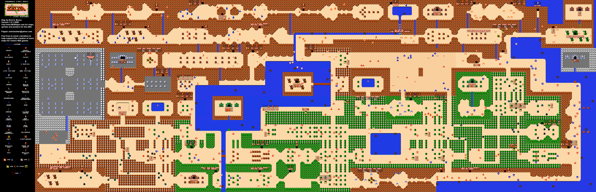

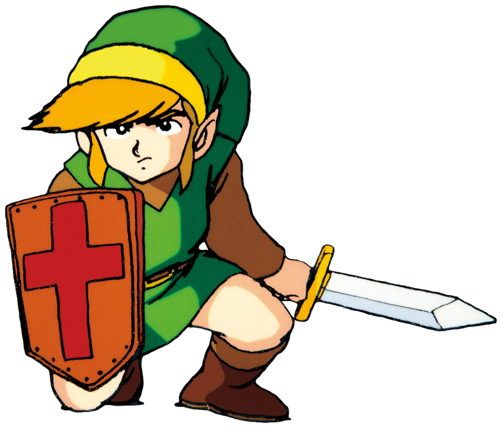

## 1. Level 1: The Eagle

**Location & How to Get There:** It's hidden inside a dead tree on an island in the middle of a lake.

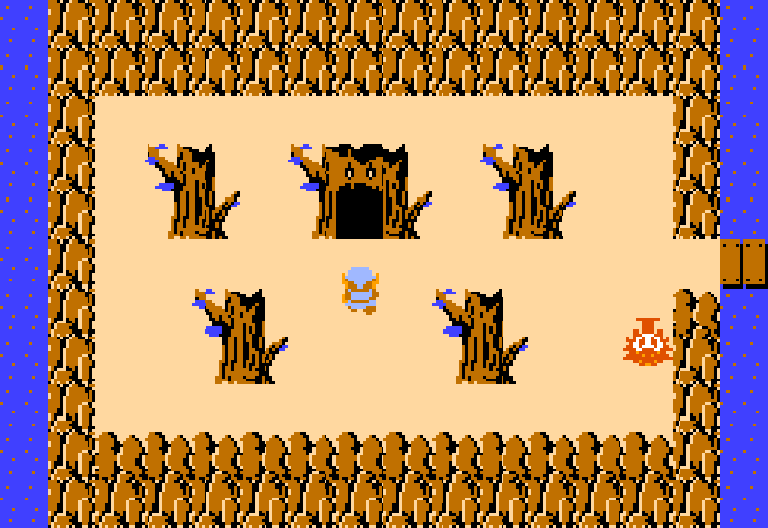

**The Layout:** The dungeon map is shaped like an eagle. It is very straight forward to navigate. It has a lighter blue color scheme with water. The enemies aren't very difficult either.

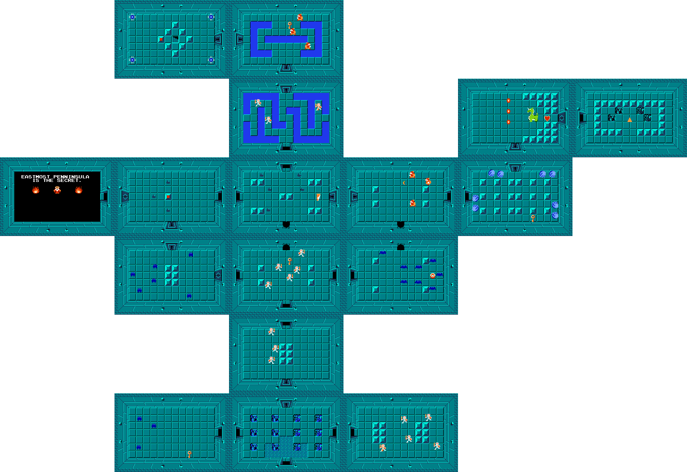

**Key Items:**

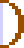
* **The Bow:** Allows you to shoot arrows which damage enemies, costs 1 rupee per shot, due to the hardware limitations at the time your money and arrows are the same resource.

* **The Wooden Boomerang:** Stuns enemies and retrieves items from afar.

**The Boss: Aquamentus**
A green, fire-breathing dragon. You can defeat it easily with a few sword slashes to the horn.
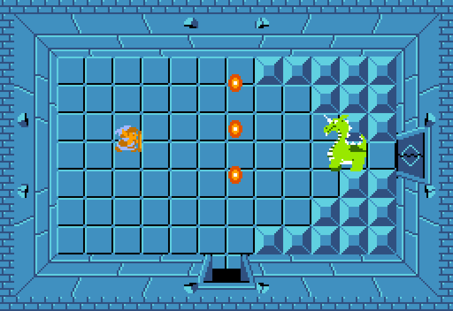

**Difficulty:** 2/10 Very Easy, a great dungeon for introducing new players to the mechanics of the game.

**My Rating:** 9/10. It’s a classic, iconic first level that perfectly introduces the mechanics of the game without being too punishing. I really like the blue colors here, and the entrance is very iconic.

## 2. The Moon

**Location & How to Get There:** It's on a small hill in a forest, surrounded by some statues.

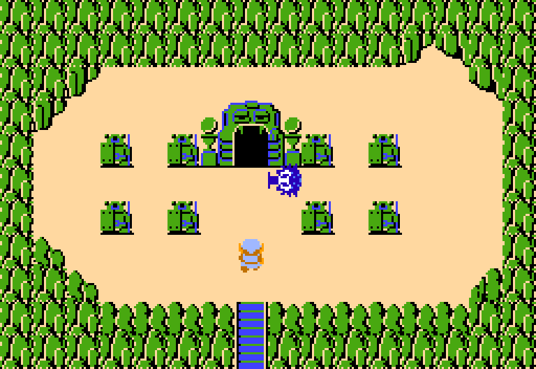

**The Layout:** The name of this level is called Moon, its shape represent a crescent moon as well.

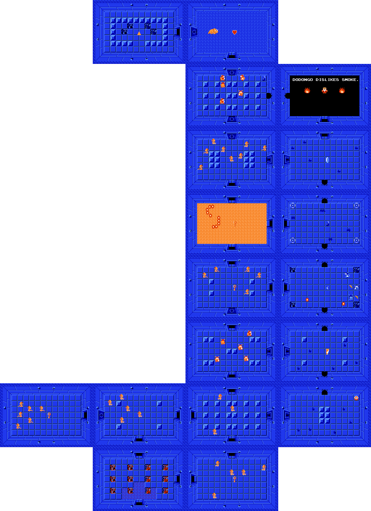

**Key Items:**

* **The Magical Boomerang:** An improved version of the Wooden Boomerang unlocked in level 1. It has a longer range.

**The Boss: Dodongo**
An orange dinosaur-looking creature. You need bombs to defeat it, you can either feed it 2 bombs, or stun it with the smoke of a bomb's explosion then finish it off with your sword.
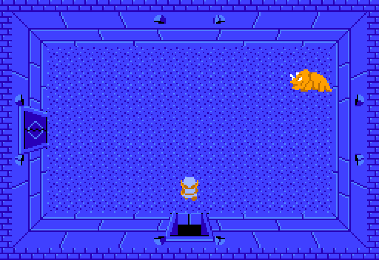

**Difficulty:** 3/10 Easy, the Magical Boomerang room is pretty tough other than that, it's about as hard as the first level,

**My Rating:** 8/10. You could argue that the layout is even more simple compared to level 1. It has a beautiful dark blue color scheme, with a lot of orange enemies and sand, which it contrasts with very nicely.

## 3. The Manji

**Location & How to Get There:** It's surrounded by some hills, very close to the starting square.

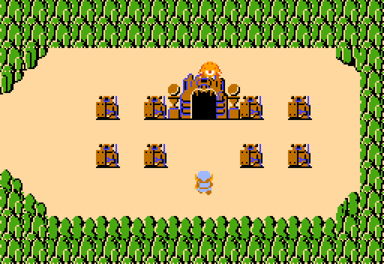

**The Layout:** The shape of this level represents a Manji, a symbol used in Asian countries for peace, not to be confused with the hate symbol based off of it.

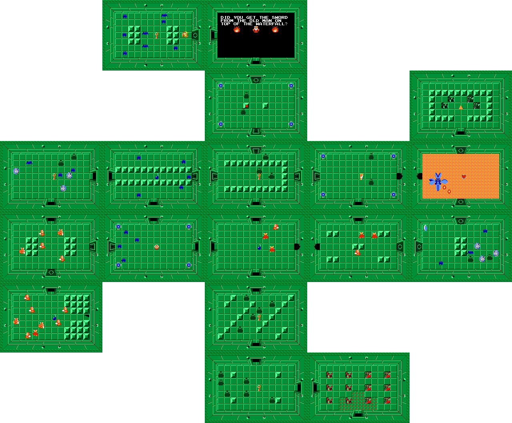

**Key Items:**

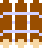
* **The Raft:** A raft you can use in the overworld to access areas closed off by water. It is required for level 4.

**The Boss: Manhandla**
A four-headed evil plant. This is the most difficult boss so far. You need to destroy each of its heads, but it gets faster and more aggressive as you destroy more of them.
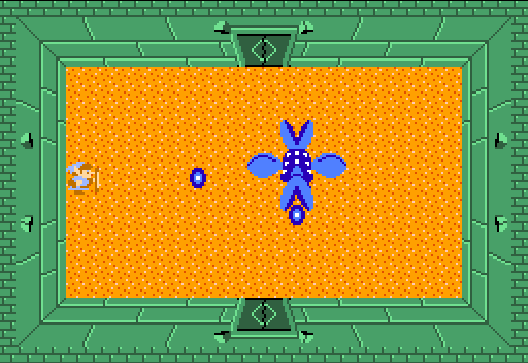

**Difficulty:** 6/10 This is where things start to ramp up, with the new Darknut enemies getting introduced, and the new boss Manhandla, this dungeon is tough, especially if you don't have any sword, or armor upgrades.

**My Rating:** 6/10. This level is fine. It introduces a more complicated dungeon to the player, and shows them that some key items can be very hard to find if you don't pay attention. I don't like the color scheme that much as the others, it is a very light green, the color of Link's sprite also has a slightly different color here, compared to everywhere in the entire game.

## 4. The Snake

## 5. The Lizard

## 6. The Dragon

## 7. The Demon

## 8. The Lion

## 9. Death Mountain
