# The Legend of Zelda (NES) Dungeons

## 0. Summary
The Legend of Zelda was originally released in 1986 for the NES by Nintendo. On this website, I will cover my favorite part about the game: the dungeons!
In order to beat the game you have to visit 9 dungeons in the overworld and defeat the big bad Ganon.
Each dungeon has items you can obtain, some of them are mandatory to beat the game.
Each dungeon has a different layout, enemies, a different boss, a different color scheme and either lava or water, or neither.
Every dungeon has a name. They were named after the shape their map layout has.

## 1. Level 1: The Eagle

**Location & How to Get There:** It's hidden inside a dead tree on an island in the middle of a lake.

**The Layout:** The dungeon map is shaped like an eagle. It is very straight forward to navigate. It has a lighter blue color scheme with water. The enemies aren't very difficult either.

**Key Items:**

* **The Bow:** Allows you to shoot arrows which damage enemies, costs 1 rupee per shot, due to the hardware limitations at the time your money and arrows are the same resource.

* **The Wooden Boomerang:** Stuns enemies and retrieves items from afar.

**The Boss: Aquamentus**
A green, fire-breathing dragon. You can defeat it easily with a few sword slashes to the horn.

**Difficulty:** 2/10 Very Easy, a great dungeon for introducing new players to the mechanics of the game.

**My Rating:** 9/10. It’s a classic, iconic first level that perfectly introduces the mechanics of the game without being too punishing. I really like the blue colors here, and the entrance is very iconic.

## 2. The Moon

**Location & How to Get There:** It's on a small hill in a forest, surrounded by some statues.

**The Layout:** The name of this level is called Moon, its shape represent a crescent moon as well.

**Key Items:**

* **The Magical Boomerang:** An improved version of the Wooden Boomerang unlocked in level 1. It has a longer range.

**The Boss: Dodongo**
An orange dinosaur-looking creature. You need bombs to defeat it, you can either feed it 2 bombs, or stun it with the smoke of a bomb's explosion then finish it off with your sword.

**Difficulty:** 3/10 Easy, the Magical Boomerang room is pretty tough other than that, it's about as hard as the first level,

**My Rating:** 8/10. You could argue that the layout is even more simple compared to level 1. It has a beautiful dark blue color scheme, with a lot of orange enemies and sand, which it contrasts with very nicely.

## 3. The Manji

**Location & How to Get There:** It's surrounded by some hills, very close to the starting square.

**The Layout:** The shape of this level represents a Manji, a symbol used in Asian countries for peace, not to be confused with the hate symbol based off of it.

**Key Items:**

* **The Raft:** A raft you can use in the overworld to access areas closed off by water. It is required for level 4.

**The Boss: Manhandla**
A four-headed evil plant. This is the most difficult boss so far. You need to destroy each of its heads, but it gets faster and more aggressive as you destroy more of them.

**Difficulty:** 6/10 This is where things start to ramp up, with the new Darknut enemies getting introduced, and the new boss Manhandla, this dungeon is tough, especially if you don't have any sword, or armor upgrades.

**My Rating:** 6/10. This level is fine. It introduces a more complicated dungeon to the player, and shows them that some key items can be very hard to find if you don't pay attention. I don't like the color scheme that much as the others, it is a very light green, the color of Link's sprite also has a slightly different color here, compared to everywhere in the entire game.

## 4. The Snake

**Location & How to Get There:** It's found on an island. You need the raft from level 3 to access it.

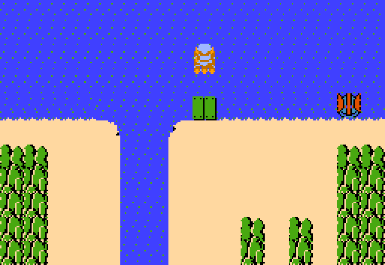
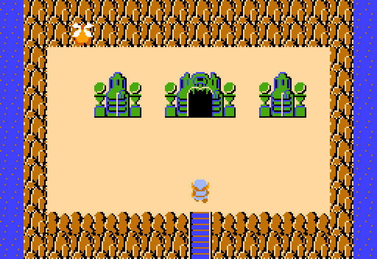

**The Layout:** This level is shaped like a snake. There is a secret room in the snake's eye, you can access with bombs!

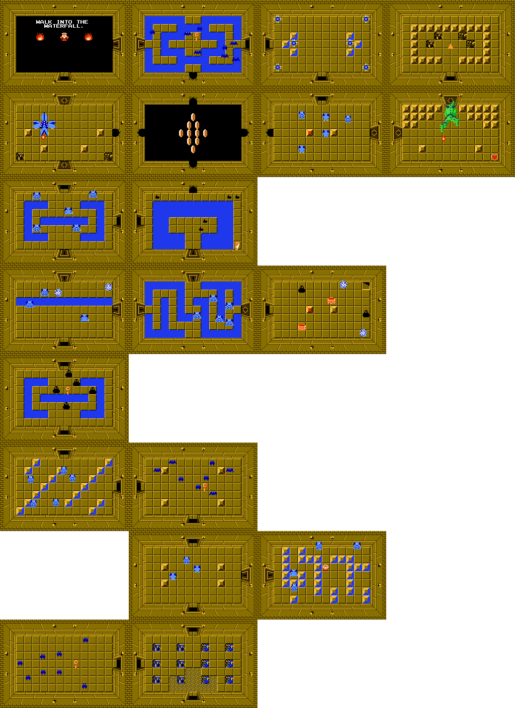

**Key Items:**

* **The Stepladder:** A ladder you can use to cross gaps in water and lava.

**The Boss: Gleeok (2 Heads)**: A two headed dragon shooting fireballs. You need to attack its heads to defeat it. Watch out! Once you destroy a head it gets decapitated and flies around attacking you!

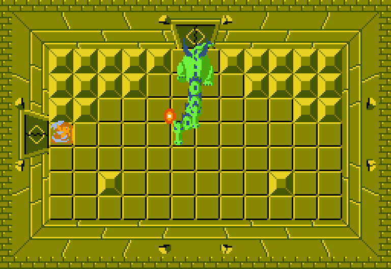

**Difficulty:** 5/10 Slightly easier than level 3 in my opinion. There are no Darknuts, and easier enemies overall. You can also use the stepladder from now to stay on water tiles where enemies can't go.

**My Rating:** 10/10. My favorite level personally, the difficulty is just right for me to be the most enjoyable. The stepladder item will come in very handy throughout the entire game. I really like the yellow color scheme mixed with blue water.

## 5. The Lizard

**Location & How to Get There:** It's found in an area called the Lost Hills. A room which loops, in every direction except west. You need to go north 4 times to reach the level's entrance.

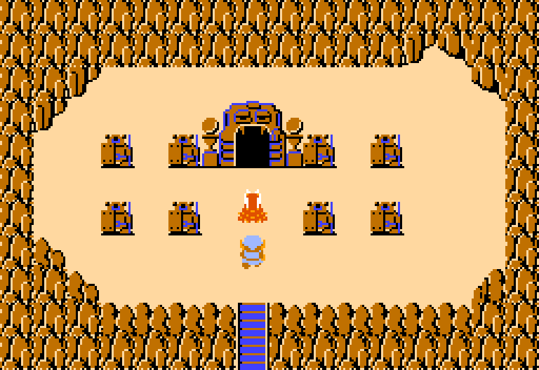

**The Layout:** The level is shaped like a Lizard. I could never really see the resemblance to be honest. This is the first level which has lava instead of water. You can also find an old man here, who sells a bomb upgrade, that is very useful to buy, allowing you to carry up to 12 bombs, instead of the default 8.

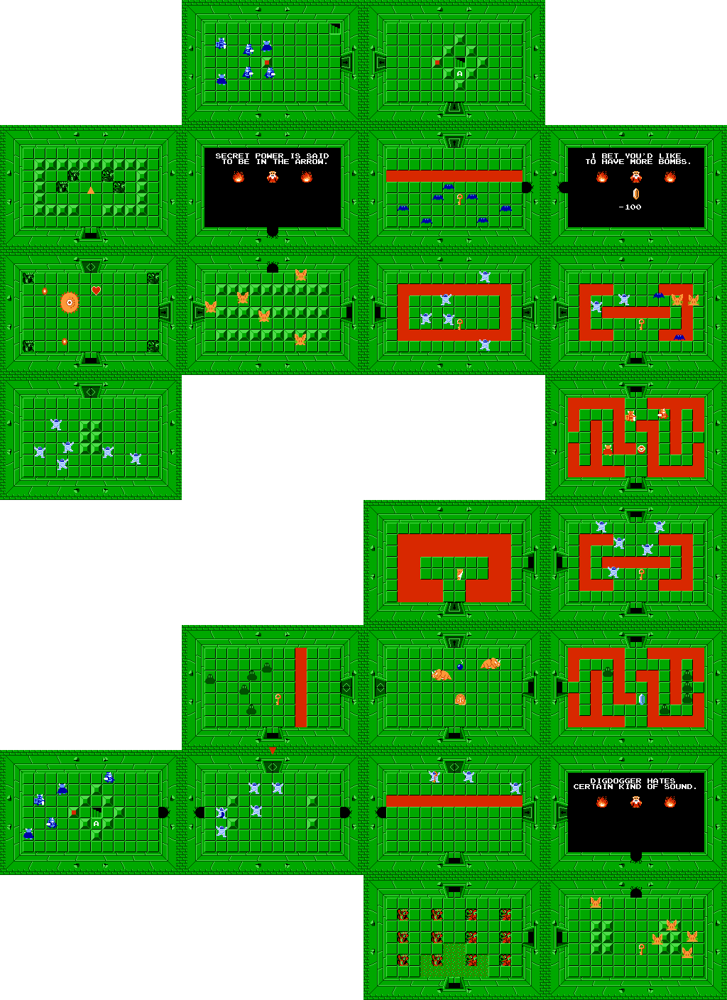

**Key Items:**

* **The Whistle:** A pretty niche item. In the overworld you can use it to fast travel between the levels you already beat, via a tornado. You also need it to defeat the Digdogger bosses. This item is required to enter level 7.

**The Boss: Digdogger**: An eye monster. Use the whistle to make it shrink. Once weakened by the whistle you can use your sword to easily defeat it.

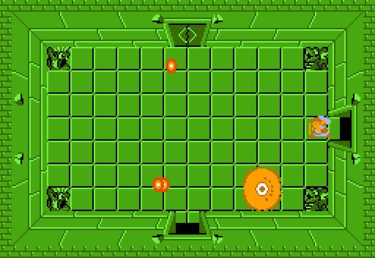

**Difficulty:** 7/10 This is where the difficulty really starts to ramp up. Some of the toughest enemies in the game appear here first, like the Blue Darknuts, Gibdos and Pols Voices. But at this point in the game you are well equipped to handle the challenge.

**My Rating:** 8/10. A very solid level. I like the green color scheme mixed with lava. It introduces the player to tougher enemies, I'd consider this dungeon a halfway point of the game, with the enemies being moderately difficult, but the layout not being that complicated yet.

## 6. The Dragon

**Location & How to Get There:** This level is found right next to the graveyard. It is pretty far away from the starting square, in a more difficult to get to area in the overworld.

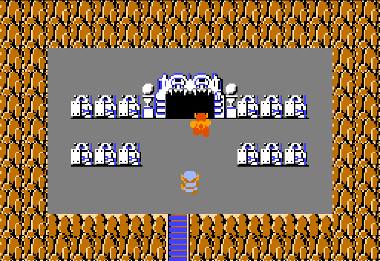

**The Layout:** It is shaped like a Dragon. This is where the levels start to get really big, with a lot of rooms.

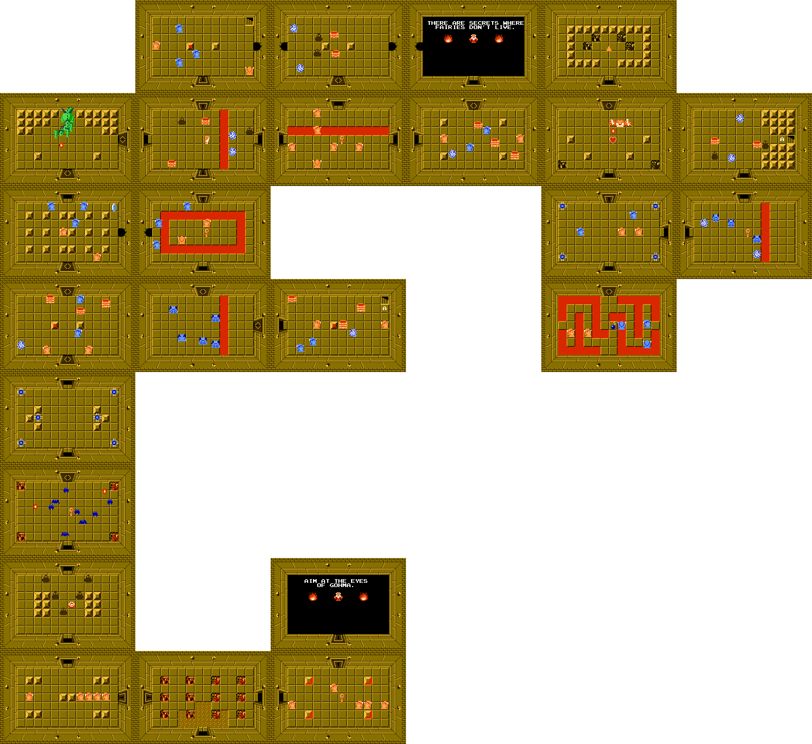

**Key Items:**

* **The Magic Wand:** A very useful item! It has infinite ammo, so you can perform attacks without being at full health to do sword beams, or having to burn your rupees for the bow.

**The Boss: Gohma**: A big spider with a single eye. It closes and opens its eye while moving around, you need to time an arrow shot into its eye to defeat it. Pretty easy boss overall.

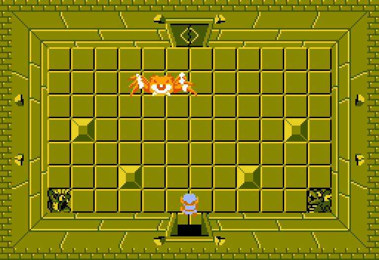

**Difficulty:** 10/10 The most difficult level in my opinion, after the final level. It has the toughest enemies in the game, Wizzrobes. Not only that, it has a LOT of them. This mixed with the dungeon being huge, and the enemies respawning, and you being sent back to the start of the level with each death makes the difficulty very hard. Funnily enough the boss is one of the easiest parts of this level.

**My Rating:** 6/10. An okay level, the huge difficulty spike makes it annoying to me, with both level 7, 8 and arguably even 9 being easier makes it be in a strange spot. Other than that the dark yellow color scheme mixed with lava looks fine. The Magic Wand you unlock here is very handy.

## 7. The Demon

**Location & How to Get There:** This level is found hidden in a lake. You need to use the whistle found in level 5 to enter it. When you play your whistle next to the lake, it will get drained, uncovering the entrance to the level.

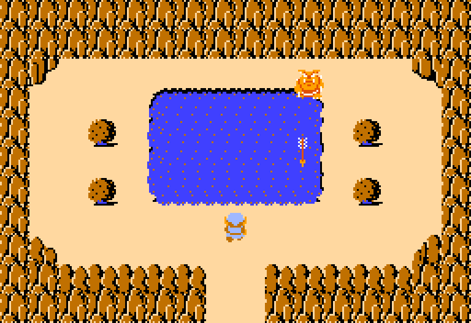
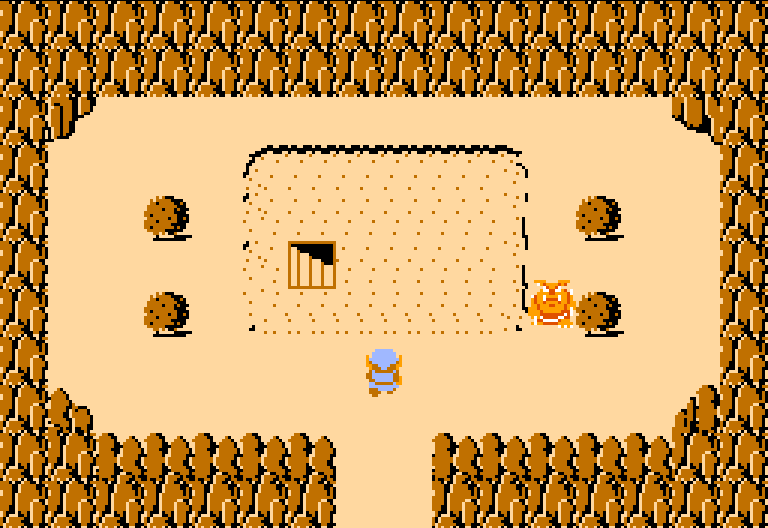

**The Layout:** It is shaped like the head of a demon. You could say it looks like the head of any reptile, but they went with demon officially. Similiar to level 6, this level is huge, even larger.

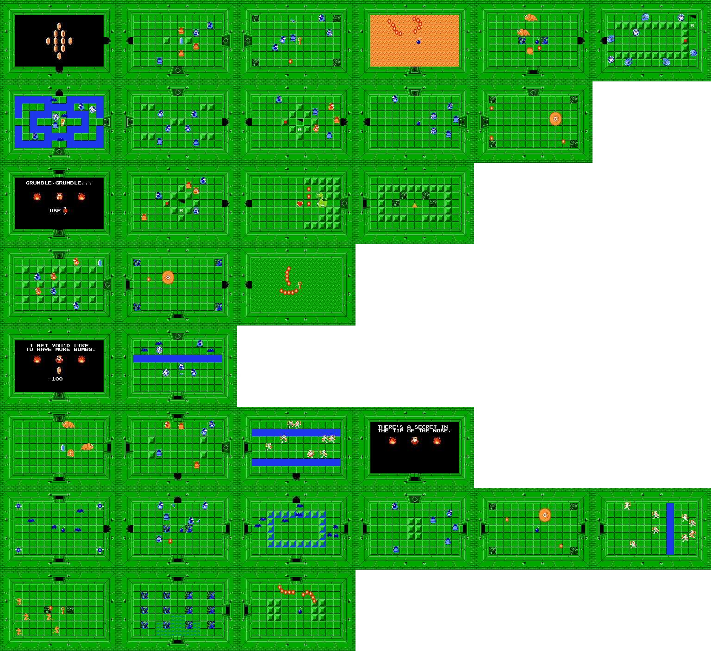

**Key Items:**

* **The Red Candle:** This item is okay. Compared to the Blue Candle you can buy in shops, it lets you use it infinitely without having to leave and re-enter the screen. Other than burning some overworld trees, I didn't find it very useful.

**The Boss: Aquamentus**: The exact same boss as Level 1. Very easy and underwhelming at this point in the game.

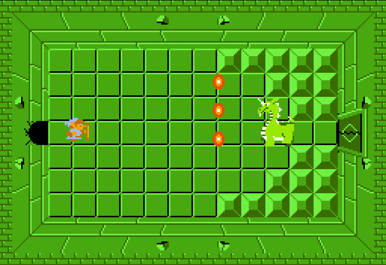

**Difficulty:** 7/10 This level isn't that difficult, it just has some inconveniences. The layout is huge, the enemies aren't that difficult, there's a hidden passage you need to find. There is also an enemy here called the Hungry Gorya, who you have to feed a Monster Food item, the only way to obtain it, is to buy it from a shop in the overworld for either 60 or 100 rupees. If you don't feed it, it won't let you pass.

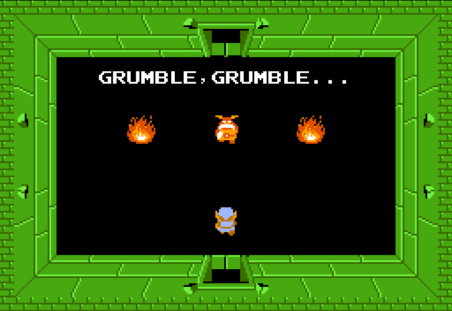

**My Rating:** 9/10. A very good level in my opinion. The difficulty drop compared to the previous level is nice. I really like the dark green color scheme mixed with water. Besides level 5 this level has a hidden bomb upgrade too, allowing you to carry up to 16 bombs from now on, very nice!

## 8. The Lion

**Location & How to Get There:** This level is found hidden under a tree you need to burn in a forest, pretty well hidden.

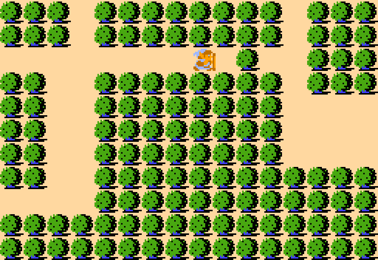
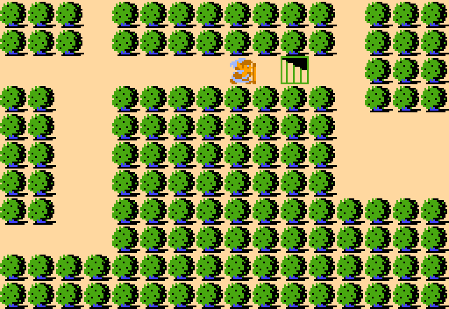

**The Layout:** The level is shaped like the head of a lion. It resembles the shape of the magical key you unlock here. The size is slightly smaller than level 7, but it is still huge.

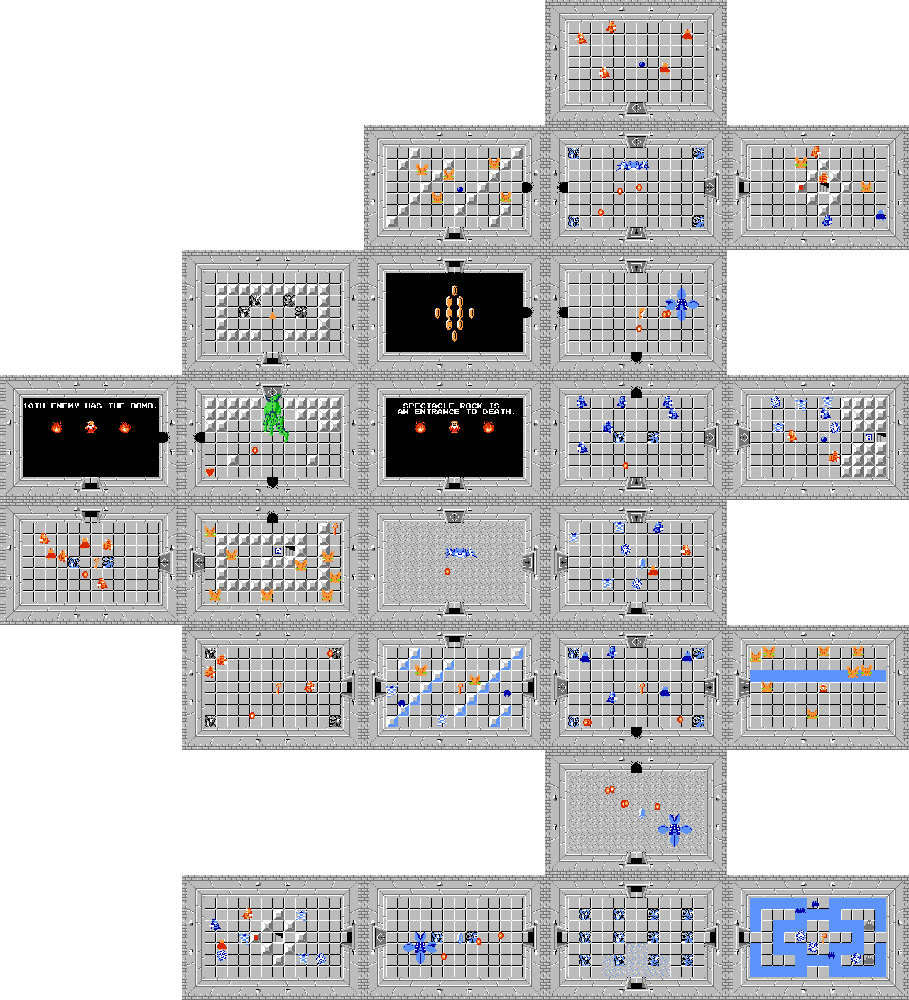

**Key Items:**

* **The Magical Key:** A very useful item! It allows you to have an infinite amount of keys. You can open every door in every level without needing to use any small keys. It will come in very handy for the last level.

* **The Magic Book:** An upgrade for the Wand you unlocked in level 6. Now it will deal more damage, and leave fire when it lands. Pretty handy.

**The Boss: Gleeok (4 Heads)**: The same boss as level 4, except it has double the heads this time! It can be pretty difficult, but at this point you have so many hearts and good equipment, it won't be too difficult.

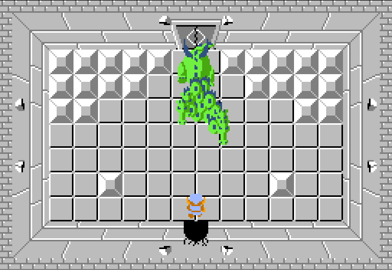

**Difficulty:** 9/10 This level is pretty difficult, featuring a lot of the previous bosses just roaming around, along with Blue Darknuts. Some of the previous levels had some of the previous bosses as well as mini bosses, but this level has the most of them. Besides the main Gleeok boss there are 3 Manhandlas, and 2 Blue Gohmas.

**My Rating:** 9/10. An all-around very solid level. I like the metallic-gray color scheme mixed with the brighter water.

## 9. Death Mountain

**Location & How to Get There:** This level is found inside Spectacle Rock. You need to bomb the entrance to uncover it.

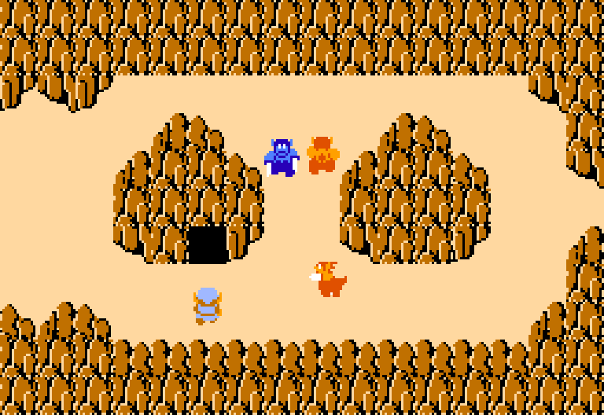

**The Layout:** The final level is shaped like a Skull. This is the largest level in the entire game by far, it has many hidden passages, some of them serving no purpose other than making you go in circles, and getting you lost. The boss is found inside the left eye socket of the skull.

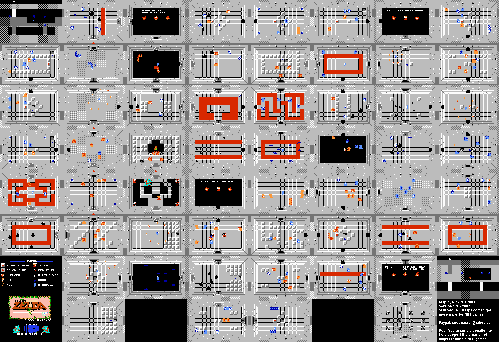

**Key Items:**

* **The Red Ring:** The second armor upgrade in the game. The first one, the Blue Ring was an optional item sold at a shop for 250 rupees, it halved the damage you took from all sources. The red ring makes you take 4 times less damage you would by default! Making the level much easier.

* **The Silver Arrow:** This is a mandatory item, you need it to defeat the final boss, Ganon.

**The Boss: Ganon**: The final boss of the game, and the villain of the Zelda series. This fight is pretty tough, Ganon turns invisible, moves around in a weird pattern, and shoots fireballs at you, which deal a lot of damage. You need to keep hitting him while invisible. Once you hit him with your sword enough he gets stunned. You need to finish him off with a Silver Arrow.

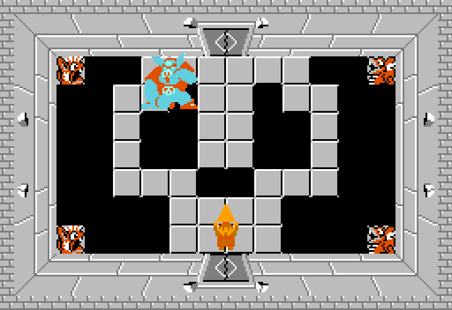

**Difficulty:** 10/10 This level is very difficult, being fitting for the final challenge of the game. The layout is very confusing, and the enemies are very tough too. You need to pay a lot of attention on what room you want to go next, a lot of the paths you can take are traps, which take you back to the start. 

### For reference on this image you can see the most optimal path you can take if you have the Magical Key unlocked.
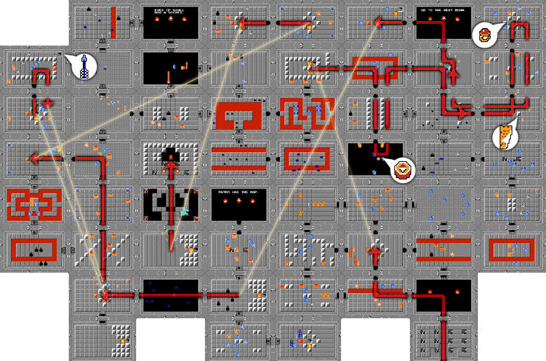

**My Rating:** 8/10. A pretty good final challenge, sometimes it can feel too much though. I like the gray color scheme mixed with lava. Beating this level without a guide makes you a true veteran at this game.
